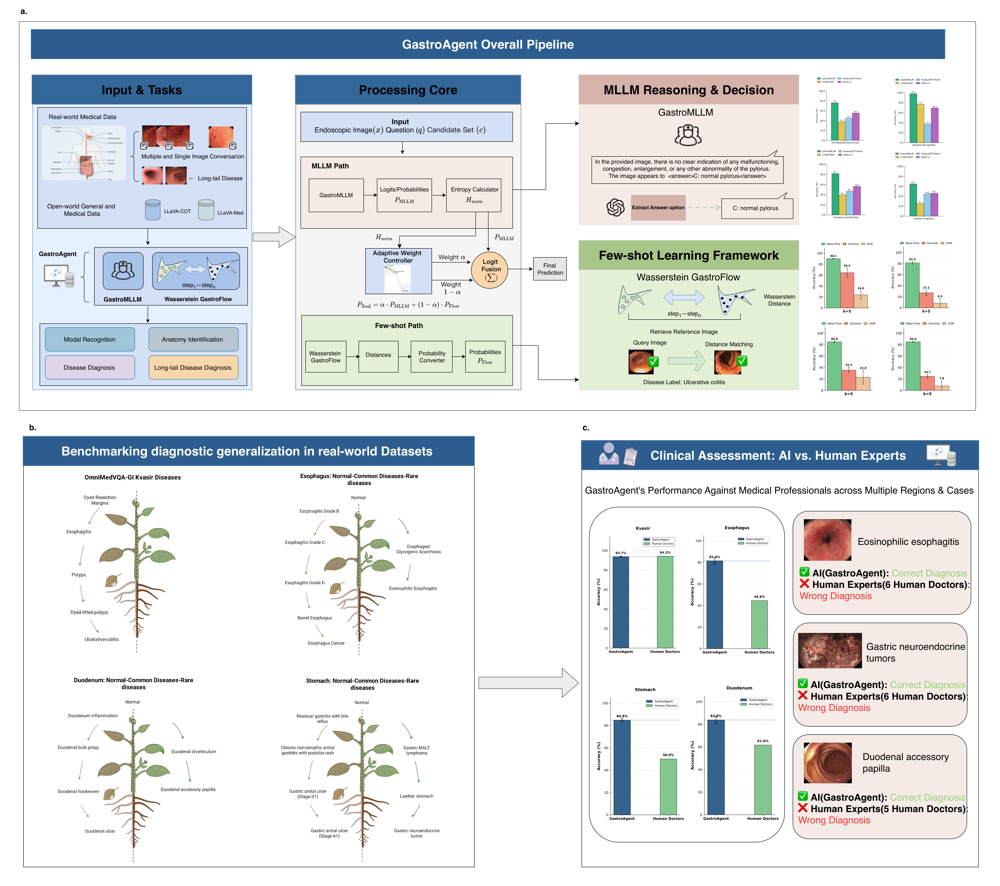

# GastroAgent

<div align="center">

[](LICENSE)
[](https://www.python.org/downloads/)
[](https://pytorch.org/)

**几何感知多模态 AI 解决胃肠道诊断中的长尾悖论**

*Geometry-aware multimodal AI resolves the long-tail paradox in gastrointestinal diagnostics*

[English](README_EN.md) | 简体中文

</div>

---

## 目录

- [简介](#简介)
- [主要特性](#主要特性)
- [更新日志](#更新日志)
- [系统要求](#系统要求)
- [安装指南](#安装指南)
- [模型权重与演示数据](#模型权重与演示数据)
- [快速复现 Demo](#快速复现-demo)
  - [Demo A — Wasserstein-GastroFlow 推理与评估](#demo-a--wasserstein-gastroflow-推理与评估)
  - [Demo B — GastroAgent 端到端融合推理](#demo-b--gastroagent-端到端融合推理)
- [训练说明](#训练说明)
- [项目结构](#项目结构)
- [可视化结果](#可视化结果)
- [引用](#引用)
- [致谢](#致谢)
- [数据开放说明](#数据开放说明)
- [许可证](#许可证)
- [联系方式](#联系方式)

---

## 简介

GastroAgent 是一个面向上消化道内窥镜检查的多模态 AI 诊断框架，核心目标是在真实临床场景中同时兼顾**常见病灶稳定识别**与**长尾罕见病变可靠覆盖**。

系统由三个核心模块和一个融合控制器组成：

| 模块 | 职责 |
|------|------|
| **GastroMLLM** | 多模态大语言模型，负责医学推理与报告生成 |
| **Flow-Match 生成器** | 学习从查询图像到参考分布的生成轨迹 |
| **Wasserstein-GastroFlow** | 沿生成轨迹计算最优传输代价，实现少样本几何匹配 |
| **熵感知自适应权重控制器** | 动态融合 GastroMLLM 与 Wasserstein-GastroFlow 的预测结果 |

在标准化 Kvasir 数据集上，GastroAgent 达到 **93.7%** 诊断准确率；在长尾队列上，食管不常见病变 **81.4%**、胃部 **84.8%**、十二指肠 **83.8%**。

<!-- 整体工作流图：[`assets/figures/overview-ill.jpg`](/mnt/inaisfs/data/home/tansy_criait/GasAgent-main/assets/figures/overview-ill.jpg) -->
整体工作流图

<!-- (/mnt/inaisfs/data/home/tansy_criait/GasAgent-main/assets/figures/overview-ill.jpg) -->
---

## 主要特性

- **长尾友好诊断**：针对 GI 场景中不平衡分布问题，提升罕见病变识别能力。
- **多模态医学推理**：结合视觉证据与文本推理，支持更完整的诊断解释。
- **几何匹配可解释性**：基于最优传输代价，提供从查询样本到参考样本的路径证据。
- **可复现 Demo 流程**：覆盖 Wasserstein-GastroFlow 单模块评估和 GastroAgent 融合评估。
- **模块化训练设计**：GastroMLLM、Flow-Match、Wasserstein-GastroFlow 可独立训练与替换。

---

## 更新日志

- **2026-03-05**
  - 统一并补全中文 README 的安装、Demo 与训练说明。
  - 新增可视化结果展示与更详细的项目结构说明。
  - 优化路径占位符与命令注释，便于一键复现。

---

## 系统要求

### 硬件

| 项目 | 要求 |
|------|------|
| **GPU** | NVIDIA GPU，显存 >= 24 GB（推荐 A100 40 GB） |
| **内存** | >= 32 GB RAM |
| **存储** | >= 40 GB 可用空间（含模型权重与数据集） |

### 软件

| 项目 | 版本 |
|------|------|
| **操作系统** | Linux（推荐 Ubuntu 20.04 / 22.04） |
| **Python** | >= 3.11 |
| **PyTorch** | >= 2.5.1 |
| **CUDA** | >= 12.1 |
| **cuDNN** | 与 CUDA 版本匹配 |

已验证环境：Ubuntu 22.04 / Python 3.11.8 / PyTorch 2.5.1 / CUDA 12.1

---

## 安装指南

预计耗时约 10-15 分钟（取决于网络速度）。

### 1) 克隆仓库

```bash
git clone https://github.com/GastroAgent/GastroAgent.git
cd GastroAgent
```

### 2) 创建并激活环境

```bash
conda create -n GastroAgent python=3.11 -y
conda activate GastroAgent
```

### 3) 安装 PyTorch（CUDA 12.1 示例）

```bash
pip install torch==2.5.1 torchvision==0.20.1 torchaudio==2.5.1 \
    --index-url https://download.pytorch.org/whl/cu121
```

如使用其他 CUDA 版本，请参考 [PyTorch 官方安装页](https://pytorch.org/get-started/locally/)。

### 4) 安装项目依赖

```bash
pip install -r requirements.txt
```

若 `requirements.txt` 中 `flash-attn` 安装失败，可先注释该行并按 [Flash Attention 官方指南](https://github.com/Dao-AILab/flash-attention) 手动安装。

### 5) 验证安装

```bash
python -c "import torch; print('PyTorch:', torch.__version__); print('CUDA:', torch.cuda.is_available())"
```

---

## 模型权重与演示数据

所有模型权重与演示数据托管在 Hugging Face：
[https://huggingface.co/GastroAgent/GastroAgent](https://huggingface.co/GastroAgent/GastroAgent)

### 建议下载文件

| 文件名 | 大小 | 用途 |
|--------|------|------|
| `LlavaQwen2-GRPO-Tricks-Total-CoT-6000.tar.gz` | 12.6 GB | GastroMLLM 权重 |
| `kvasir-extra.zip` | 7.44 GB | kvasir-two-label 对应 Wasserstein-GastroFlow 权重 |
| `kvasir.zip` | 7.42 GB | kvasir-three-label 对应 Wasserstein-GastroFlow 权重 |
| `image_option_two_label/` | - | two-label 参考图像 |
| `image_options/` | - | three-label 参考图像 |

### 下载与解压示例

假设统一存放到 `<WEIGHT_DIR>`：

```bash
huggingface-cli download GastroAgent/GastroAgent --local-dir <WEIGHT_DIR>
cd <WEIGHT_DIR>
tar -xzf LlavaQwen2-GRPO-Tricks-Total-CoT-6000.tar.gz
unzip kvasir-extra.zip -d kvasir-extra
unzip kvasir.zip -d kvasir
```

`kvasir-extra` 关键文件说明：

- `wass_model.pt`：Wasserstein 度量模型（对应 `--wass_model_path`）
- `otcfm_weights_step_50000.pt`：Flow-Match 权重（对应 `--checkpoint`）
- `convnext2.pt`：判停器权重（对应 `--sim_model_path`）

---

## 快速复现 Demo

下文使用占位符，请按实际路径替换：

- `<PROJECT_ROOT>`：项目根目录（即 `GastroAgent/`）
- `<WEIGHT_DIR>`：模型权重解压根目录

预计运行时间：在单张 40 GB A100 GPU 上，每个 Demo 约 10-15 分钟（主要耗时在 Wasserstein 距离近似计算）。

### Demo A — Wasserstein-GastroFlow 推理与评估

目标：在 `kvasir-two-label` 上完成 Wasserstein 距离计算与准确率统计。

1) 数据准备：
- 下载 Hugging Face 的 `image_option_two_label/` 到本地（建议放在 `<WEIGHT_DIR>/image_option_two_label/`）
- 检查 `<PROJECT_ROOT>/demo_data/kvasir-two-label/final_eval/final_eval_flat.json`：
  - `x0` 指向 `<PROJECT_ROOT>/demo_data/kvasir-two-label/final_eval/`
  - `x1` 指向 `<WEIGHT_DIR>/image_option_two_label/`

2) 运行距离计算：

```bash
conda activate GastroAgent

python wasserstein-gastroFlow/wass_flow_train_Kvasir/eval/cal_wass.py \
  --data_path <PROJECT_ROOT>/demo_data/kvasir-two-label/final_eval/final_eval_flat.json \
  --checkpoint <WEIGHT_DIR>/kvasir-extra/otcfm_weights_step_50000.pt \
  --output_dir <PROJECT_ROOT>/results/wass_kvasir_two_label \
  --wass_model_path <WEIGHT_DIR>/kvasir-extra/wass_model.pt \
  --sim_model_path <WEIGHT_DIR>/kvasir-extra/convnext2.pt
```

预期输出：`<PROJECT_ROOT>/results/wass_kvasir_two_label/result.json`

可选（集群提交）：`sbatch wasserstein-gastroFlow/wass_flow_train_Kvasir/eval/cal_wass.sh`（请先按环境修改脚本路径）。

3) 统计分类准确率：

```bash
python demo_code/wass_flow_match/cal_label_acc.py
```

运行前请在脚本中将 `in_path` 修改为上一步输出的 `result.json` 路径。常见输出文件：
- `eval_by_x0_clean.json`
- `summary_by_x0_clean.json`

### Demo B — GastroAgent 端到端融合推理

目标：融合 GastroMLLM 与 Wasserstein-GastroFlow 输出，获得最终准确率。

1) 运行 MLLM 预测流水线（共 4 步）：

```bash
python demo_code/kvasir_pipeline/run_full_pipeline.py
```

运行前请修改 `demo_code/kvasir_pipeline/step1_model_inference.py`：
- `model_id` -> `<WEIGHT_DIR>/LlavaQwen2-GRPO-Tricks-Total-CoT-6000`
- `input_data_path` -> `<PROJECT_ROOT>/demo_data/kvasir-two-label/mllm/final_doctor_exam_43.json`
- `output_data_path` -> 目标输出路径

该脚本会顺序执行 4 个步骤，建议重点关注每一步输出：

| 步骤 | 脚本 | 主要输出 |
|------|------|----------|
| 1 | `step1_model_inference.py` | `new_eval_tsy_llm_with_trigger.json` |
| 2 | `step2_extract_answers_with_llm_latest.py` | `new_eval_tsy_llm_extracted.json` |
| 3 | `step3_reevaluate_correct.py` | `new_eval_tsy_llm_final.json` |
| 4 | `step4_reanalyze_trigger_performance.py` | `new_eval_tsy_llm_trigger_report.json` |

2) 融合 MLLM 与 Flow 结果：

```bash
python demo_code/kvasir_pipeline/fusion/run_fusion_only.py \
  --mllm-path <new_eval_tsy_llm_final.json 路径> \
  --flow-path <eval_by_x0_clean.json 路径> \
  --output-dir <PROJECT_ROOT>/results/fusion_kvasir_two_label
```

输出文件：
- `fusion_results.json`
- `fusion_statistics.json`

> 若需完整复现论文在 Kvasir 全集结果，请对 `kvasir-three-label` 重复以上流程并合并统计，关键映射如下：  
> - Wasserstein 距离输入：`<PROJECT_ROOT>/demo_data/kvasir-three-label/final_eval/final_eval_flat.json`  
> - 参考图像目录：`<WEIGHT_DIR>/image_options/`  
> - MLLM 输入：`<PROJECT_ROOT>/demo_data/kvasir-three-label/mllm/final_doctor_exam_62.json`

---

## 训练说明

训练以模块化方式进行，三个核心模块可独立训练后再在融合阶段联动使用：

```text
GastroMLLM (独立)        Flow-Match 生成器 (独立)
       \                       |
        \                      v
         \           Wasserstein-GastroFlow
          \                   /
           v                 v
         GastroAgent (加载权重 + 融合校准)
```

### 1) GastroMLLM

**目标**
- 获得具备内镜场景理解、医学推理与报告生成能力的多模态模型。

**典型输入**
- 内镜图像/视频帧（或关键帧）与结构化标注（病灶类型、部位、属性等）。
- 文本监督数据（报告、结论、指令数据等）。

**训练产物**
- GastroMLLM 权重（供推理与融合阶段使用）。

**与其他模块关系**
- 可与 Flow-Match、Wasserstein-GastroFlow 独立训练。
- 在最终 GastroAgent 流程中提供医学推理和文本侧证据。

**启动命令**

SFT 训练：

```bash
bash VLM-R1/src/open-r1-multimodal/run_scripts/sft_data_v1/stage3_generate_lora_run.sh
# 或 Slurm:
sbatch VLM-R1/src/open-r1-multimodal/run_scripts/sft_data_v1/stage3_submmit.sh
```

RL（GRPO）微调：

```bash
bash VLM-R1/src/open-r1-multimodal/run_scripts/rl/run_grpo_my_server_qwen_8gpu_nodes_run.sh
# 或 Slurm:
sbatch VLM-R1/src/open-r1-multimodal/run_scripts/rl/run_grpo_my_server_qwen_8gpu_nodes_summit.sh
```

### 2) Flow-Match 生成器

**目标**
- 学习查询样本到参考分布的生成轨迹，为后续最优传输代价计算提供路径证据。

**典型输入**
- 以内镜图像为主，可按器官/部位/病灶类别划分训练子域。

**训练产物**
- Flow-Match 生成器权重（如 `otcfm_weights_step_*.pt`）。

**与其他模块关系**
- 其生成轨迹被 Wasserstein-GastroFlow 用于代价评估，因此通常建议先完成该模块训练。

**启动命令**

```bash
python train_flow_by_vae/train.py \
  --output_dir <输出目录> \
  --total_steps 10000 \
  --batch_size 4 \
  --save_step 2000
```

### 3) Wasserstein-GastroFlow

**目标**
- 在少样本与长尾类别场景中，基于“沿生成轨迹的最优传输代价”实现稳健几何匹配。

**典型输入**
- few-shot 支持集（带标签）与查询集（待识别）。
- Flow-Match 生成轨迹及相关配置参数。

**训练产物**
- Wasserstein 度量模型权重（如 `wass_model.pt`）及评估结果文件。

**与其他模块关系**
- 依赖 Flow-Match 生成器；其输出将作为 GastroAgent 融合时的重要少样本证据。

**启动命令**
- 建议先在 `wasserstein-gastroFlow/wass_flow_train_Kvasir/train/old_flow_matcher.py` 配置 Flow-Match 相关参数，再运行：

```bash
python wasserstein-gastroFlow/wass_flow_train_Kvasir/train/train_old_kvasir_Disease_extra.py \
  --train_json_glob <训练数据目录> \
  --test_json <测试数据 JSON>
```

### 4) GastroAgent 融合

融合阶段通常不是“从零训练新模型”，而是加载以上三个模块权重，在验证集上进行融合参数校准（如 `alpha-min`、`alpha-max`、`steepness`），或直接使用论文默认设置。

---

## 项目结构

```text
GastroAgent/
├── abnormal_dectect/                   # 病灶区域检测
├── assets/                             # 文档图片等静态资源
│   └── figures/                        # README 结果图/流程图
├── conditional_flow_matcher/           # 条件流匹配核心库
├── dataset/                            # 数据处理脚本
│   ├── eval_data/                      # 测试数据
│   └── xxx                             # 其他测试脚本
├── demo_code/                          # Demo 复现脚本
│   ├── kvasir_pipeline/                #   GastroAgent 端到端流水线
│   │   ├── run_full_pipeline.py        #     一键执行全部 4 步
│   │   ├── step1_model_inference.py    #     MLLM 推理
│   │   ├── step2_extract_answers_with_llm_latest.py
│   │   ├── step3_reevaluate_correct.py
│   │   ├── step4_reanalyze_trigger_performance.py
│   │   └── fusion/
│   │       ├── run_fusion_only.py      #     融合入口
│   │       └── fusion_pipeline.py      #     融合逻辑
│   └── wass_flow_match/                #   Wasserstein-GastroFlow 评估
│       ├── cal_wass.py                 #     计算 Wasserstein 距离
│       └── cal_label_acc.py            #     计算分类准确率
├── demo_data/                          # Demo 演示数据
│   ├── kvasir-two-label/
│   │   ├── final_eval/final_eval_flat.json
│   │   └── mllm/final_doctor_exam_43.json
│   └── kvasir-three-label/
│       ├── final_eval/final_eval_flat.json
│       └── mllm/final_doctor_exam_62.json
├── discriminator/                      # 判停器训练
├── GasAgenteent/                       # Agent 触发脚本
│   └── Agent_pipeline_result/          # 测试结果
├── model_utils/                        # 模型辅助函数
├── my_models/                          # Flow-Match 模型定义
├── train_clip/                         # 医学视觉编码器
├── train_flow_by_vae/                  # Flow-Match 生成器训练
├── train_vae/                          # 潜在空间编解码器
├── utils/                              # 通用辅助函数
├── VLM-R1/                             # GastroMLLM 训练框架
├── wasserstein-gastroFlow/             # Wasserstein-GastroFlow 训练与评估
│   ├── wass_flow_train_Kvasir/
│   ├── wass_flow_match_esophagus/
│   ├── wass_flow_match_stomach/
│   └── wass_flow_match_duodenum/
├── requirements.txt                    # Python 依赖
└── README.md
```

---

## 可视化结果


---

## 引用

如果本项目对您的研究有帮助，请引用：

```bibtex
@article{GastroAgent2026,
  title={GastroAgent: Geometry-aware multimodal AI resolves the long-tail paradox in gastrointestinal diagnostics},
  author={Shuyue Tan and Nuoya Zhou and Mingfei Jin and Xingwu Liu and Xianglei Yuan and Yahui Zhang and Yuyan Zhang and Qi Luo and Ruide Liu and Huan Jiang and Shunyao Wang and Hengduo Jiang and Dongbo Bu and Bing Hu and Ming Li and Shuaicheng Li},
  year={2026}
}
```

---

## 致谢

- 感谢所有数据提供方和医学专家的支持
- 本项目基于 [PyTorch](https://pytorch.org/) 开发
- 感谢开源社区的贡献

---

## 数据开放说明

除公开数据集外，我们还在另外 3 个类别更丰富的数据集上进行了系统评估，并获得了更优的整体表现。受患者隐私保护与伦理合规要求限制，相关原始数据暂不对外公开；具体实验设置与结果请参见论文正文及补充材料。

---

## 许可证

本项目采用 [Apache-2.0 License](LICENSE) 开源协议。

**注意**：本项目仅供研究使用，不得用于临床诊断。任何医学决策应由专业医生做出。

---

## 联系方式

- 问题反馈：[GitHub Issues](https://github.com/GastroAgent/GastroAgent/issues)
- 邮箱：shuyuetan0@gmail.com
<!-- - 项目主页：[https://yourproject.github.io](https://yourproject.github.io) -->

---

## Star History

如果这个项目对您有帮助，欢迎点一个 Star。

[](https://star-history.com/#yourusername/GastroAgent&Date)
