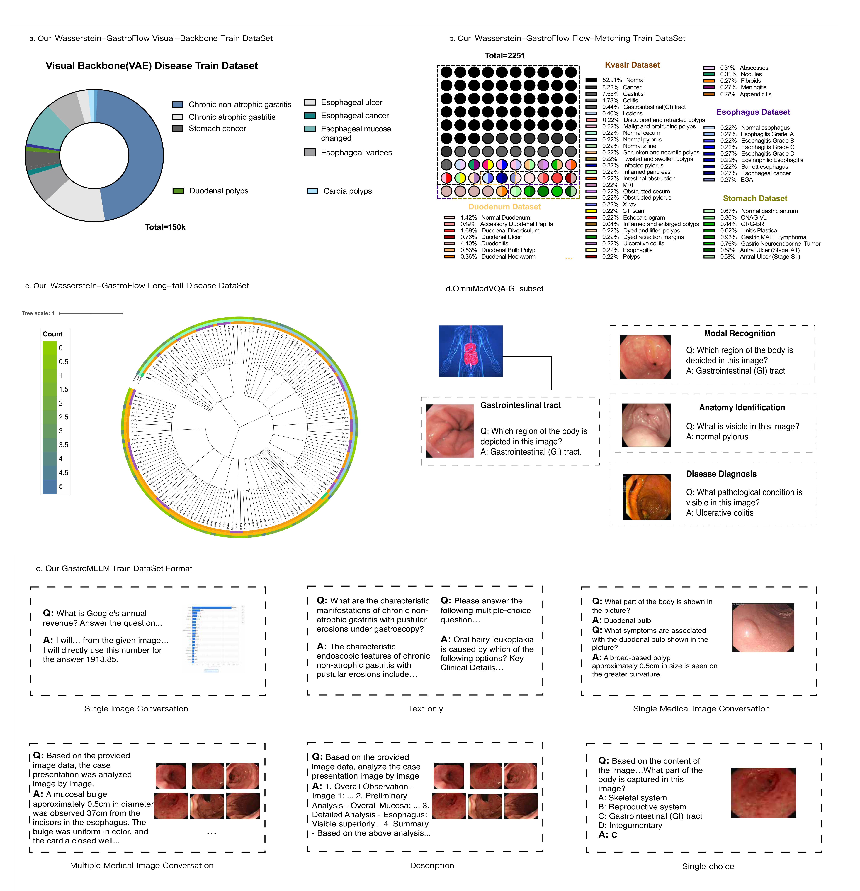
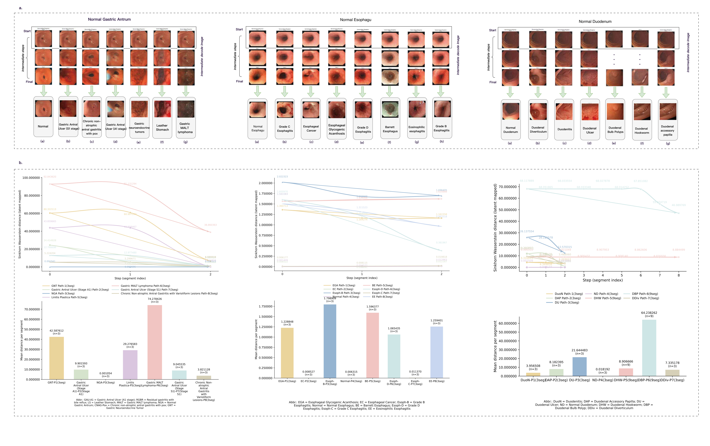
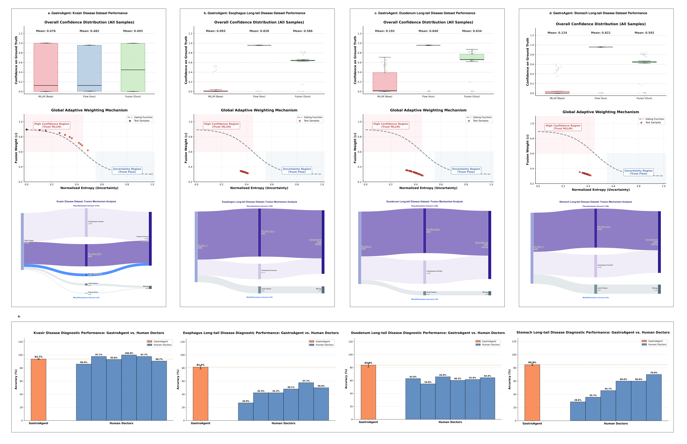

# GastroAgent

<div align="center">

[](LICENSE)
[](https://www.python.org/downloads/)
[](https://pytorch.org/)

**Geometry-aware multimodal AI resolves the long-tail paradox in gastrointestinal diagnostics**

*Geometry-aware multimodal AI resolves the long-tail paradox in gastrointestinal diagnostics*

English | [简体中文](README.md)

</div>

---

## Table of Contents

- [Overview](#overview)
- [Key Features](#key-features)
- [Changelog](#changelog)
- [System Requirements](#system-requirements)
- [Installation Guide](#installation-guide)
- [Model Weights and Demo Data](#model-weights-and-demo-data)
- [Quick Reproduction Demos](#quick-reproduction-demos)
  - [Demo A - Wasserstein-GastroFlow Inference and Evaluation](#demo-a---wasserstein-gastroflow-inference-and-evaluation)
  - [Demo B - End-to-End Fusion Inference with GastroAgent](#demo-b---end-to-end-fusion-inference-with-gastroagent)
- [Training Guide](#training-guide)
- [Project Structure](#project-structure)
- [Visualization Results](#visualization-results)
- [Citation](#citation)
- [Acknowledgments](#acknowledgments)
- [Data Availability Statement](#data-availability-statement)
- [License](#license)
- [Contact](#contact)

---

## Overview

GastroAgent is a multimodal AI diagnostic framework for upper gastrointestinal endoscopy. Its core goal is to achieve both **stable recognition of common lesions** and **reliable coverage of rare long-tail lesions** in real clinical scenarios.

The system consists of three core modules and one fusion controller:

| Module | Responsibility |
|------|------|
| **GastroMLLM** | Multimodal large language model for medical reasoning and report generation |
| **Flow-Match Generator** | Learns generative trajectories from query images to reference distributions |
| **Wasserstein-GastroFlow** | Computes optimal transport cost along generative trajectories for few-shot geometric matching |
| **Entropy-aware Adaptive Weight Controller** | Dynamically fuses predictions from GastroMLLM and Wasserstein-GastroFlow |

On the standardized Kvasir dataset, GastroAgent achieves **93.7%** diagnostic accuracy. On long-tail cohorts, it reaches **81.4%** for uncommon esophageal lesions, **84.8%** for gastric lesions, and **83.8%** for duodenal lesions.

Overall workflow figure (JPG): [`assets/figures/overview-ill.jpg`](assets/figures/overview-ill.jpg)

---

## Key Features

- **Long-tail-friendly diagnosis**: Improves recognition of rare lesions under imbalanced GI data distributions.
- **Multimodal medical reasoning**: Combines visual evidence and text reasoning for more complete diagnostic explanations.
- **Interpretable geometric matching**: Uses optimal transport cost to provide trajectory-level evidence from query to reference samples.
- **Reproducible demo workflows**: Covers both standalone Wasserstein-GastroFlow evaluation and GastroAgent fusion evaluation.
- **Modular training design**: GastroMLLM, Flow-Match, and Wasserstein-GastroFlow can be trained and replaced independently.

---

## Changelog

- **2026-03-05**
  - Unified and completed the Chinese README sections for installation, demos, and training.
  - Added visualization examples and a more detailed project structure description.
  - Improved path placeholders and command annotations for one-command reproduction.

---

## System Requirements

### Hardware

| Item | Requirement |
|------|------|
| **GPU** | NVIDIA GPU, VRAM >= 24 GB (A100 40 GB recommended) |
| **Memory** | >= 32 GB RAM |
| **Storage** | >= 40 GB available space (including model weights and datasets) |

### Software

| Item | Version |
|------|------|
| **Operating System** | Linux (Ubuntu 20.04 / 22.04 recommended) |
| **Python** | >= 3.11 |
| **PyTorch** | >= 2.5.1 |
| **CUDA** | >= 12.1 |
| **cuDNN** | Compatible with your CUDA version |

Verified environment: Ubuntu 22.04 / Python 3.11.8 / PyTorch 2.5.1 / CUDA 12.1

---

## Installation Guide

Estimated setup time: about 10-15 minutes (depending on network speed).

### 1) Clone the repository

```bash
git clone https://github.com/GastroAgent/GastroAgent.git
cd GastroAgent
```

### 2) Create and activate environment

```bash
conda create -n GastroAgent python=3.11 -y
conda activate GastroAgent
```

### 3) Install PyTorch (CUDA 12.1 example)

```bash
pip install torch==2.5.1 torchvision==0.20.1 torchaudio==2.5.1 \
    --index-url https://download.pytorch.org/whl/cu121
```

If you use another CUDA version, see the [official PyTorch installation page](https://pytorch.org/get-started/locally/).

### 4) Install project dependencies

```bash
pip install -r requirements.txt
```

If `flash-attn` fails to install from `requirements.txt`, comment it out first and install it manually following the [Flash Attention official guide](https://github.com/Dao-AILab/flash-attention).

### 5) Verify installation

```bash
python -c "import torch; print('PyTorch:', torch.__version__); print('CUDA:', torch.cuda.is_available())"
```

---

## Model Weights and Demo Data

All model weights and demo data are hosted on Hugging Face:  
[https://huggingface.co/GastroAgent/GastroAgent](https://huggingface.co/GastroAgent/GastroAgent)

### Recommended downloads

| File Name | Size | Purpose |
|--------|------|------|
| `LlavaQwen2-GRPO-Tricks-Total-CoT-6000.tar.gz` | 12.6 GB | GastroMLLM weights |
| `kvasir-extra.zip` | 7.44 GB | Wasserstein-GastroFlow weights for kvasir-two-label |
| `kvasir.zip` | 7.42 GB | Wasserstein-GastroFlow weights for kvasir-three-label |
| `image_option_two_label/` | - | two-label reference images |
| `image_options/` | - | three-label reference images |

### Example download and extraction

Assume all files are stored under `<WEIGHT_DIR>`:

```bash
huggingface-cli download GastroAgent/GastroAgent --local-dir <WEIGHT_DIR>
cd <WEIGHT_DIR>
tar -xzf LlavaQwen2-GRPO-Tricks-Total-CoT-6000.tar.gz
unzip kvasir-extra.zip -d kvasir-extra
unzip kvasir.zip -d kvasir
```

Key files in `kvasir-extra`:

- `wass_model.pt`: Wasserstein metric model (for `--wass_model_path`)
- `otcfm_weights_step_50000.pt`: Flow-Match weights (for `--checkpoint`)
- `convnext2.pt`: early-stop discriminator weights (for `--sim_model_path`)

---

## Quick Reproduction Demos

The following commands use placeholders. Replace them with your actual paths:

- `<PROJECT_ROOT>`: project root directory (i.e., `GastroAgent/`)
- `<WEIGHT_DIR>`: root directory where model weights are extracted

Estimated runtime: on a single A100 40 GB GPU, each demo takes about 10-15 minutes (the main cost is Wasserstein distance approximation).

### Demo A - Wasserstein-GastroFlow Inference and Evaluation

Goal: compute Wasserstein distances and classification accuracy on `kvasir-two-label`.

1) Data preparation:
- Download `image_option_two_label/` from Hugging Face (recommended path: `<WEIGHT_DIR>/image_option_two_label/`)
- Check `<PROJECT_ROOT>/demo_data/kvasir-two-label/final_eval/final_eval_flat.json`:
  - `x0` points to `<PROJECT_ROOT>/demo_data/kvasir-two-label/final_eval/`
  - `x1` points to `<WEIGHT_DIR>/image_option_two_label/`

2) Run distance computation:

```bash
conda activate GastroAgent

python wasserstein-gastroFlow/wass_flow_train_Kvasir/eval/cal_wass.py \
  --data_path <PROJECT_ROOT>/demo_data/kvasir-two-label/final_eval/final_eval_flat.json \
  --checkpoint <WEIGHT_DIR>/kvasir-extra/otcfm_weights_step_50000.pt \
  --output_dir <PROJECT_ROOT>/results/wass_kvasir_two_label \
  --wass_model_path <WEIGHT_DIR>/kvasir-extra/wass_model.pt \
  --sim_model_path <WEIGHT_DIR>/kvasir-extra/convnext2.pt
```

Expected output: `<PROJECT_ROOT>/results/wass_kvasir_two_label/result.json`

Optional (cluster submission): `sbatch wasserstein-gastroFlow/wass_flow_train_Kvasir/eval/cal_wass.sh` (please update paths in the script first).

3) Compute classification accuracy:

```bash
python demo_code/wass_flow_match/cal_label_acc.py
```

Before running, set `in_path` in the script to the `result.json` path produced in the previous step. Common output files:
- `eval_by_x0_clean.json`
- `summary_by_x0_clean.json`

### Demo B - End-to-End Fusion Inference with GastroAgent

Goal: fuse outputs from GastroMLLM and Wasserstein-GastroFlow to obtain final accuracy.

1) Run the MLLM prediction pipeline (4 steps total):

```bash
python demo_code/kvasir_pipeline/run_full_pipeline.py
```

Before running, edit `demo_code/kvasir_pipeline/step1_model_inference.py`:
- `model_id` -> `<WEIGHT_DIR>/LlavaQwen2-GRPO-Tricks-Total-CoT-6000`
- `input_data_path` -> `<PROJECT_ROOT>/demo_data/kvasir-two-label/mllm/final_doctor_exam_43.json`
- `output_data_path` -> target output path

This script runs the following 4 steps in order. Track each output file:

| Step | Script | Main Output |
|------|------|----------|
| 1 | `step1_model_inference.py` | `new_eval_tsy_llm_with_trigger.json` |
| 2 | `step2_extract_answers_with_llm_latest.py` | `new_eval_tsy_llm_extracted.json` |
| 3 | `step3_reevaluate_correct.py` | `new_eval_tsy_llm_final.json` |
| 4 | `step4_reanalyze_trigger_performance.py` | `new_eval_tsy_llm_trigger_report.json` |

2) Fuse MLLM and Flow results:

```bash
python demo_code/kvasir_pipeline/fusion/run_fusion_only.py \
  --mllm-path <new_eval_tsy_llm_final.json path> \
  --flow-path <eval_by_x0_clean.json path> \
  --output-dir <PROJECT_ROOT>/results/fusion_kvasir_two_label
```

Output files:
- `fusion_results.json`
- `fusion_statistics.json`

> To fully reproduce the paper's Kvasir complete-set results, repeat the same workflow on `kvasir-three-label` and merge statistics. Key mappings are:  
> - Wasserstein distance input: `<PROJECT_ROOT>/demo_data/kvasir-three-label/final_eval/final_eval_flat.json`  
> - Reference image directory: `<WEIGHT_DIR>/image_options/`  
> - MLLM input: `<PROJECT_ROOT>/demo_data/kvasir-three-label/mllm/final_doctor_exam_62.json`

---

## Training Guide

Training is modular. The three core modules can be trained independently and then combined in the fusion stage:

```text
GastroMLLM (independent)        Flow-Match Generator (independent)
       \                       |
        \                      v
         \           Wasserstein-GastroFlow
          \                   /
           v                 v
         GastroAgent (load weights + fusion calibration)
```

### 1) GastroMLLM

**Goal**
- Obtain a multimodal model with endoscopic scene understanding, medical reasoning, and report generation capabilities.

**Typical Inputs**
- Endoscopic images/video frames (or keyframes) with structured annotations (lesion type, location, attributes, etc.).
- Text supervision data (reports, conclusions, instruction data, etc.).

**Training Outputs**
- GastroMLLM weights (used in inference and fusion stages).

**Relationship with Other Modules**
- Can be trained independently of Flow-Match and Wasserstein-GastroFlow.
- Provides medical reasoning and text-side evidence in the final GastroAgent workflow.

**Launch Commands**

SFT training:

```bash
bash VLM-R1/src/open-r1-multimodal/run_scripts/sft_data_v1/stage3_generate_lora_run.sh
# or Slurm:
sbatch VLM-R1/src/open-r1-multimodal/run_scripts/sft_data_v1/stage3_submmit.sh
```

RL (GRPO) fine-tuning:

```bash
bash VLM-R1/src/open-r1-multimodal/run_scripts/rl/run_grpo_my_server_qwen_8gpu_nodes_run.sh
# or Slurm:
sbatch VLM-R1/src/open-r1-multimodal/run_scripts/rl/run_grpo_my_server_qwen_8gpu_nodes_summit.sh
```

### 2) Flow-Match Generator

**Goal**
- Learn the generative trajectory from query samples to reference distributions, providing trajectory evidence for downstream optimal transport cost computation.

**Typical Inputs**
- Primarily endoscopic images, optionally split into training subdomains by organ/location/lesion category.

**Training Outputs**
- Flow-Match generator weights (e.g., `otcfm_weights_step_*.pt`).

**Relationship with Other Modules**
- Its generated trajectories are used by Wasserstein-GastroFlow for cost evaluation, so this module is usually trained first.

**Launch Command**

```bash
python train_flow_by_vae/train.py \
  --output_dir <output directory> \
  --total_steps 10000 \
  --batch_size 4 \
  --save_step 2000
```

### 3) Wasserstein-GastroFlow

**Goal**
- Achieve robust geometric matching in few-shot and long-tail scenarios using optimal transport cost along generated trajectories.

**Typical Inputs**
- Few-shot support set (labeled) and query set (to be recognized).
- Flow-Match trajectories and related configuration parameters.

**Training Outputs**
- Wasserstein metric model weights (e.g., `wass_model.pt`) and evaluation result files.

**Relationship with Other Modules**
- Depends on the Flow-Match generator; its outputs are used as important few-shot evidence in GastroAgent fusion.

**Launch Command**
- It is recommended to first configure Flow-Match-related parameters in `wasserstein-gastroFlow/wass_flow_train_Kvasir/train/old_flow_matcher.py`, then run:

```bash
python wasserstein-gastroFlow/wass_flow_train_Kvasir/train/train_old_kvasir_Disease_extra.py \
  --train_json_glob <training data directory> \
  --test_json <test data JSON>
```

### 4) GastroAgent Fusion

The fusion stage is typically not "training a new model from scratch." Instead, it loads the three module weights above and performs fusion-parameter calibration on a validation set (e.g., `alpha-min`, `alpha-max`, `steepness`), or directly uses the default settings from the paper.

---

## Project Structure

```text
GastroAgent/
├── abnormal_dectect/                   # Lesion region detection
├── assets/                             # Static resources such as doc images
│   └── figures/                        # README result figures / workflow figures
├── conditional_flow_matcher/           # Core conditional flow-matching library
├── dataset/                            # Data processing scripts
│   ├── eval_data/                      # Evaluation data
│   └── xxx                             # Other test scripts
├── demo_code/                          # Demo reproduction scripts
│   ├── kvasir_pipeline/                #   End-to-end GastroAgent pipeline
│   │   ├── run_full_pipeline.py        #     One-click execution of all 4 steps
│   │   ├── step1_model_inference.py    #     MLLM inference
│   │   ├── step2_extract_answers_with_llm_latest.py
│   │   ├── step3_reevaluate_correct.py
│   │   ├── step4_reanalyze_trigger_performance.py
│   │   └── fusion/
│   │       ├── run_fusion_only.py      #     Fusion entrypoint
│   │       └── fusion_pipeline.py      #     Fusion logic
│   └── wass_flow_match/                #   Wasserstein-GastroFlow evaluation
│       ├── cal_wass.py                 #     Compute Wasserstein distance
│       └── cal_label_acc.py            #     Compute classification accuracy
├── demo_data/                          # Demo data
│   ├── kvasir-two-label/
│   │   ├── final_eval/final_eval_flat.json
│   │   └── mllm/final_doctor_exam_43.json
│   └── kvasir-three-label/
│       ├── final_eval/final_eval_flat.json
│       └── mllm/final_doctor_exam_62.json
├── discriminator/                      # Early-stop discriminator training
├── GasAgenteent/                       # Agent trigger scripts
│   └── Agent_pipeline_result/          # Test results
├── model_utils/                        # Model utility functions
├── my_models/                          # Flow-Match model definitions
├── train_clip/                         # Medical vision encoder
├── train_flow_by_vae/                  # Flow-Match generator training
├── train_vae/                          # Latent-space encoder-decoder
├── utils/                              # Common utility functions
├── VLM-R1/                             # GastroMLLM training framework
├── wasserstein-gastroFlow/             # Wasserstein-GastroFlow training and evaluation
│   ├── wass_flow_train_Kvasir/
│   ├── wass_flow_match_esophagus/
│   ├── wass_flow_match_stomach/
│   └── wass_flow_match_duodenum/
├── requirements.txt                    # Python dependencies
└── README.md
```

---

## Visualization Results





---

## Citation

If this project helps your research, please cite:

```bibtex
@article{GastroAgent2026,
  title={GastroAgent: Geometry-aware multimodal AI resolves the long-tail paradox in gastrointestinal diagnostics},
  author={Shuyue Tan and Nuoya Zhou and Mingfei Jin and Xingwu Liu and Xianglei Yuan and Yahui Zhang and Yuyan Zhang and Qi Luo and Ruide Liu and Huan Jiang and Shunyao Wang and Hengduo Jiang and Dongbo Bu and Bing Hu and Ming Li and Shuaicheng Li},
  year={2026}
}
```

---

## Acknowledgments

- Thanks to all data providers and medical experts for their support.
- This project is developed based on [PyTorch](https://pytorch.org/).
- Thanks to the open-source community for its contributions.

---

## Data Availability Statement

In addition to public datasets, we conducted systematic evaluation on three additional datasets with richer categories and achieved better overall performance. Due to patient privacy protection and ethical compliance requirements, the corresponding raw data are not publicly available at this stage. Please refer to the main paper and supplementary materials for detailed experimental settings and results.

---

## License

This project is released under the [Apache-2.0 License](LICENSE).

**Note**: This project is for research use only and must not be used for clinical diagnosis. Any medical decision should be made by qualified physicians.

---

## Contact

- Issue tracker: [GitHub Issues](https://github.com/GastroAgent/GastroAgent/issues)
- Email: shuyuetan0@gmail.com
<!-- - Project page: [https://yourproject.github.io](https://yourproject.github.io) -->

---

## Star History

If this project is helpful to you, a Star is welcome.

[](https://star-history.com/#yourusername/GastroAgent&Date)
# GastroAgent

<div align="center">

[](LICENSE)
[](https://www.python.org/downloads/)
[](https://pytorch.org/)

**Geometry-aware multimodal AI resolves the long-tail paradox in gastrointestinal diagnostics**

*Multimodal AI medical assistant for upper gastrointestinal endoscopy*

[English](README_EN.md) | [简体中文](README.md)

</div>

---

## 📋 Table of Contents

- [Introduction](#-introduction)
- [Key Features](#-key-features)
- [Changelog](#-changelog)
- [System Requirements](#system-requirements)
- [Installation Guide](#-installation-guide)
- [Model Weights](#-model-weights)
- [Demo](#-demo)
  - [Demo 1: Inference (Quick Start)](#demo-1-inference-quick-start)
  - [Demo 2: Training Pipeline](#demo-2-training-pipeline)
- [Usage](#-usage)
- [Datasets](#-datasets)
- [Training](#-training)
  - [GastroMLLM](#gastromllm)
  - [Flow-Match Generator](#flow-match-generator)
  - [Wasserstein-GastroFlow](#wasserstein-gastroflow)
  - [Full Integration: GastroAgent](#full-integration-gastroagent)
- [Evaluation](#-evaluation)
- [Project Structure](#-project-structure)
- [Visualization](#-visualization)
- [Citation](#-citation)
- [Acknowledgements](#-acknowledgements)
- [License](#-license)

---

## 📖 Introduction

GastroAgent is a multimodal AI medical assistant system for upper gastrointestinal (GI) endoscopy. It is designed for real-world clinical scenarios where you need both **stable recognition of common lesions** and **reliable coverage of long-tail rare conditions**.

GI endoscopy faces a long-tail disease distribution: many clinically important diagnoses are relatively rare. Traditional AI systems are often optimized for common lesions only, leaving insufficient coverage for uncommon-but-critical diseases—one of the key barriers to safe clinical deployment.

We propose **GastroAgent (the overall diagnostic framework in this repository)**, which dynamically fuses the general reasoning ability of a multimodal large language model (**GastroMLLM**) with the geometric matching evidence from a few-shot learning module (**Wasserstein-GastroFlow**) via an **entropy-aware adaptive weight controller**. The few-shot module uses optimal transport as a similarity metric: along a learned generative trajectory, it transforms a query image and uses the transport cost required to map it to labeled support samples as evidence, providing interpretable support for uncommon diseases.

Across four GI benchmark datasets, this integrated workflow outperforms metric-learning and diffusion baselines, achieving **93.7%** diagnostic accuracy on the standardized Kvasir dataset. The adaptive fusion significantly improves long-tail cohorts while maintaining performance on common diseases: **81.4%** for uncommon esophageal lesions, **84.8%** for gastric lesions, and **83.8%** for duodenal lesions. By unifying multimodal report generation with robust few-shot recognition, GastroAgent provides a more complete, clinically aligned, broad-coverage endoscopic intelligence solution.

- **Overall workflow (diagram)**


## System Requirements

Ensure your environment meets the following requirements before installation.

### Hardware

| Item | Requirement |
|------|-------------|
| **CPU** | x86_64 (multi-core recommended) |
| **Memory** | ≥ 32 GB RAM recommended |
| **GPU** | NVIDIA GPU, ≥ 24 GB VRAM recommended (e.g. A100, V100, RTX 3090/4090) |
| **Storage** | ≥ 40 GB free space recommended (including models and datasets) |

### Software

| Item | Version |
|------|---------|
| **OS** | Linux (Ubuntu 20.04 / 22.04 recommended) |
| **Python** | ≥ 3.11 |
| **PyTorch** | ≥ 2.5.1 |
| **CUDA** | ≥ 12.1 (required for GPU training and inference) |
| **cuDNN** | Match your CUDA version |

### Optional Dependencies

- **Flash Attention**: Speeds up attention computation; install the appropriate wheel for your CUDA and PyTorch versions.
- Other Python dependencies are listed in the project root `requirements.txt`.

---

## 🛠️ Installation Guide

Follow the steps below to set up the environment and install dependencies.

### 1. Clone the repository

```bash
git clone https://github.com/GastroAgent/GastroAgent.git
cd GastroAgent
```

### 2. Create and activate a virtual environment

Using Conda (recommended):

```bash
conda create -n GastroAgent python=3.11
conda activate GastroAgent
```

Or using venv:

```bash
python3.11 -m venv venv
source venv/bin/activate   # Linux/macOS
# or on Windows: venv\Scripts\activate
```

### 3. Install PyTorch (with CUDA)

Choose the install command that matches your CUDA version from the [PyTorch website](https://pytorch.org/get-started/locally/). For example, CUDA 12.1:

```bash
pip install torch==2.5.1 torchvision==0.20.1 torchaudio==2.5.1 --index-url https://download.pytorch.org/whl/cu121
```

### 4. Install project dependencies

```bash
pip install -r requirements.txt
```

**Note**: If `requirements.txt` includes local-path dependencies (e.g. Flash Attention or custom packages), adjust those lines for your environment or install them separately before running the above command.

### 5. Verify installation

From the project root, check that PyTorch and CUDA are available:

```bash
python -c "import torch; print('PyTorch:', torch.__version__); print('CUDA available:', torch.cuda.is_available())"
```

If the output shows `CUDA available: True`, the GPU environment is set up correctly.

---

## 📦 Model Weights

### Pretrained models

We provide the following trained model weights: GastroMLLM, Flow-Match generator, and Wasserstein-GastroFlow:
[Hugging Face](https://huggingface.co/GastroAgent/GastroAgent)

Specify the weight paths in the corresponding configuration files.

---

## 🎬 Demo

This section describes two runnable demos: **Inference (Quick Start)** and **Training pipeline**.

### Prerequisites

- Environment set up according to the [Installation Guide](#-installation-guide)
- Pretrained weights downloaded from [Model Weights](#-model-weights) and extracted to the path referred to as `your_path` in the commands below

---

### Demo 1: Inference (Quick Start)

Run batch inference on endoscopy images using the pretrained weights (run from the project root; replace `your_path` with your actual path):

```bash
conda activate GastroAgent

python wasserstein-gastroFlow/wass_flow_train_Kvasir/eval/cal_wass.py \
  --data_path ./dataset/eval_data/exam_dataset_extra_flatten.json \
  --checkpoint your_path/base-flow-match_vae/otcfm/otcfm_weights_step_55000.pt \
  --output_dir your_path/wass_flow_train_Kvasir/result \
  --wass_model_path your_path/best_flow_weights/attention_dy_tsy.pt \
  --sim_model_path your_path/discriminator/latent_model_weight/convnext2.pt
```

Or run directly:

```bash
sbatch wasserstein-gastroFlow/wass_flow_train_Kvasir/eval/cal_wass.sh
```

After inference, results are saved under `--output_dir` (default output is `result.json`). The terminal will show lesion type, site, confidence, and a short summary of few-shot matching evidence.

---

### Demo: GastroMLLM (multimodal LLM) training pipeline

- **SFT fine-tuning**:  
  `bash /mnt/inaisfs/data/home/tansy_criait/GasAgent-main/VLM-R1/src/open-r1-multimodal/run_scripts/sft_data_v1/stage3_generate_lora_run.sh`  
  Or submit via Slurm: `sbatch VLM-R1/src/open-r1-multimodal/run_scripts/sft_data_v1/stage3_submmit.sh`

- **RL fine-tuning**:  
  `bash VLM-R1/src/open-r1-multimodal/run_scripts/rl/run_grpo_my_server_qwen_8gpu_nodes_run.sh`  
  Or submit via Slurm: `sbatch VLM-R1/src/open-r1-multimodal/run_scripts/rl/run_grpo_my_server_qwen_8gpu_nodes_summit.sh`

### Demo: Wasserstein-GastroFlow training pipeline

The full training pipeline has three stages (replace `your_path` with your actual path):

**Stage 1: Train the Flow-Match generator**

```bash
conda activate GastroAgent

python train_flow_by_vae/train_kvasir_Disease.py \
  --data_path ./dataset \
  --output_dir your_path/base-flow-match_vae/otcfm \
  --epochs 100
```

**Stage 2: Train Wasserstein-GastroFlow**

```bash
python wasserstein-gastroFlow/wass_flow_train_Kvasir/train/flow_matcher.py \
  --data_path ./dataset \
  --checkpoint your_path/base-flow-match_vae/otcfm/otcfm_weights_step_55000.pt \
  --output_dir your_path/best_flow_weights \
  --epochs 100
```

**Stage 3: Train the discriminator**

```bash
python discriminator/train.py \
  --data_path ./dataset \
  --output_dir your_path/discriminator/latent_model_weight \
  --epochs 50
```

> For exact arguments in each stage, see the `--help` output of the corresponding script. More detailed training options are described in the [Training](#-training) section.

---

## 📘 Usage

General steps for running GastroAgent inference and (optionally) training.

### 1. Environment and data preparation

- Set up the environment according to [System Requirements](#system-requirements) and the [Installation Guide](#-installation-guide).
- Prepare endoscopy images for inference (common formats such as `.jpg`, `.png` are supported). For paper evaluation, prepare the datasets as described in [Datasets](#-datasets).

### 2. Download model weights

- Download pretrained weights from the link in [Model Weights](#-model-weights) (e.g. Hugging Face).
- Set the weight paths in the project config (e.g. `configs/inference_config.yaml` or the config for each module).

### 3. Run inference

- **Single or batch images**: Use the provided inference script (e.g. `inference.py`) with image path(s) and output directory.
- **Full diagnostic pipeline**: For the fused framework, configure weights for GastroMLLM, Flow-Match, and Wasserstein-GastroFlow; the Agent pipeline will run multimodal reasoning and few-shot evidence fusion automatically.

### 4. View results and visualization

- Inference output typically includes: diagnostic class, confidence, optional report text, and evidence visualization.
- For plots and result figures, see [Visualization](#-visualization) and [Evaluation](#-evaluation).

### 5. Advanced: training and evaluation

- For training or fine-tuning, follow the sub-module instructions (GastroMLLM, Flow-Match, Wasserstein-GastroFlow) in [Training](#-training).
- Metrics and reproduction steps are in [Evaluation](#-evaluation).

> **Disclaimer**: This project is for research only and must not replace clinical diagnosis. Any medical decision must be made by qualified physicians.

---

## 🔧 Training

Training in this project is organized into **three core parts** (module-level):

- **GastroMLLM**: Multimodal large language model (medical reasoning and report generation)
- **Flow-Match generator**: Generative model that learns trajectories / transformation paths
- **Wasserstein-GastroFlow**: Few-shot module based on optimal transport cost (uses Flow-Match trajectories as evidence paths)

Overall, **GastroAgent (full diagnostic framework) = GastroMLLM + Flow-Match generator + Wasserstein-GastroFlow + entropy-aware adaptive weight controller (fusion)**. The fusion stage usually does not require “training a new model from scratch”; it is mainly **loading the three module weights and performing necessary calibration on a validation set (e.g. thresholds)**.

> Below we describe each part by “module role + training inputs/outputs + artifacts”. For exact CLI options, refer to the training entry scripts (e.g. `train.py`) and configs (e.g. `configs/train_config.yaml`) in the repository.

### GastroMLLM

- **Goal**: Obtain a multimodal model with endoscopic scene understanding and medical report generation as the base for “medical reasoning + text generation”.
- **Typical training data**:
  - Endoscopy images / video frames (or keyframes) + structured labels (lesion type, site, attributes)
  - Text supervision (reports, conclusions, conversational instruction data, etc.)
- **Artifacts**: GastroMLLM weights.
- **Relation to other modules**: Can be trained **independently** of Flow-Match / Wasserstein-GastroFlow; used at inference in GastroAgent fusion to generate explanations and reports.

### Flow-Match Generator

- **Goal**: Learn a “query sample → reference distribution” generative trajectory / transformation path to provide an interpretable path for subsequent optimal transport cost computation.
- **Typical training data**: Mainly endoscopy images (optionally split by organ/site/lesion category) to learn stable trajectories.
- **Artifacts**: Flow-Match generator weights (for trajectories / intermediate states).
- **Relation to other modules**: Supplies trajectories (or cost-evaluation paths) to **Wasserstein-GastroFlow**; we recommend **training this module first** before training or evaluating the few-shot module.

### Wasserstein-GastroFlow

- **Goal**: Under few-shot / long-tail settings, use “optimal transport cost along the generative trajectory” as a similarity measure for robust geometric matching and interpretable evidence.
- **Typical training setup**:
  - Few-shot support set (labeled) and query set (to be recognized)
  - Use Flow-Match trajectories to compute transport cost / matching score from each query to each candidate class support set
- **Artifacts**: Few-shot module parameters (if any), support-set feature index, cost-metric config, and cost statistics / visualizations for evaluation.
- **Relation to other modules**: **Depends on the Flow-Match generator**; its output is a main source of “few-shot evidence” for the GastroAgent fusion controller.

### Full Integration: GastroAgent

- **Goal**: Adaptively fuse evidence from **GastroMLLM (multimodal medical model)** and **Wasserstein-GastroFlow (few-shot learning)** to better balance common-class stability and long-tail coverage.
- **Typical workflow**:
  - Load GastroMLLM, Wasserstein-GastroFlow (and Flow-Match generator) weights and configs
  - Calibrate **entropy/confidence-related fusion hyperparameters** on a validation set, or use our provided hyperparameters

---

## 📈 Evaluation

> It is recommended to keep result figures under `assets/figures/`. The paths below are placeholders; replace with the actual files when available.

### Result figures

- **Doctor dataset**


- **Few-shot learning example**


- **Workflow results**


---

## 📁 Project Structure

```
GastroAgent/
├── abnormal_dectect/           # lesion region detection
├── assets/                     # static assets (figures, etc.)
│   └── figures/                # README result/workflow figures
├── conditional_flow_matcher/   # conditional flow matching
├── dataset/                    # data processing scripts
│   ├── eval_data/              # evaluation data
│   ├── xxx                     # other test scripts
├── discriminator/              # discriminator training scripts
├── GasAgenteent/               # Agent trigger scripts
│   ├── Agent_pipeline_result/ # test results
├── model_utils/                # model helper functions
├── my_models/                  # Flow-Match model structure files
├── train_clip/                 # medical visual encoder
├── train_flow_by_vae/          # train Flow-Match generator
├── train_vae/                  # latent-space encoder-decoder
├── utils/                      # helper utilities
├── VLM-R1/                     # MLLM training framework
├── requirements.txt            # dependency list
├── wass_flow_match_duodenum/   # Wasserstein-GastroFlow
└── README.md                   # readme
```

## 📄 Citation

If this project is helpful for your research, please cite:

```bibtex
@article{GastroAgent2026,
  title={GastroAgent: Geometry-aware multimodal AI resolves the long-tail paradox in gastrointestinal diagnostics},
  author={Your Name and Others},
  journal={arXiv preprint arXiv:XXXX.XXXXX},
  year={2026}
}
```

---

## 🙏 Acknowledgements

- Thanks to all data providers and medical experts for their support
- This project is built with [PyTorch](https://pytorch.org/) and [MMDetection](https://github.com/open-mmlab/mmdetection)
- Thanks to the open-source community

---

## 📜 License

This project is released under the [MIT License](LICENSE).

**Disclaimer**: This project is for research use only and must not be used for clinical diagnosis. Any medical decision should be made by qualified physicians.

---

## 📮 Contact

- **Issues**: [GitHub Issues](https://github.com/GastroAgent/GastroAgent/issues)
- **Email**: shuyuetan0@gmail.com
- **Homepage**: [Project homepage](https://yourproject.github.io)

---

## 🌟 Star History

If this project helps you, please give us a ⭐️!

[](https://star-history.com/#yourusername/GastroAgent&Date)
